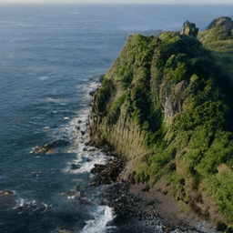
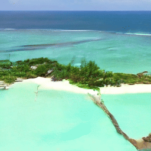

# Text to video generation with different model architectures.
## spatial-temporal diffusion transformers (DiT)
This is the main model used by this repo, described in [models.py](models.py) and [blocks.py](blocks.py). The architecture is mainly borrowed from https://github.com/hpcaitech/Open-Sora, but we also made some modifications. 

## temporal layer adapter to pretrained Stable Diffusion models
The second model architecture we implemented is to add temporal layers to existing SD unets, described in [videoldm.py](videoldm.py) and [videoldm_blocks.py](videoldm_blocks.py). This architecture is first proposed in Align your Latents paper (https://arxiv.org/abs/2304.08818). A reference implementation is given by https://github.com/srpkdyy/VideoLDM and we adapt it to our unified training framework.

## data preprocessing
We choose to preprocess video data with pretrained VAE and captions with existing text encoder first, as in [preprocess_encoding.py](preprocess_encoding.py). Next, the model (STDiT or VideoLDM) loads the preprocessed data and do the diffusion training in latent space.

## results
aerial shot of a small rocky island

a luxury tourist island with a pier and bungalows

